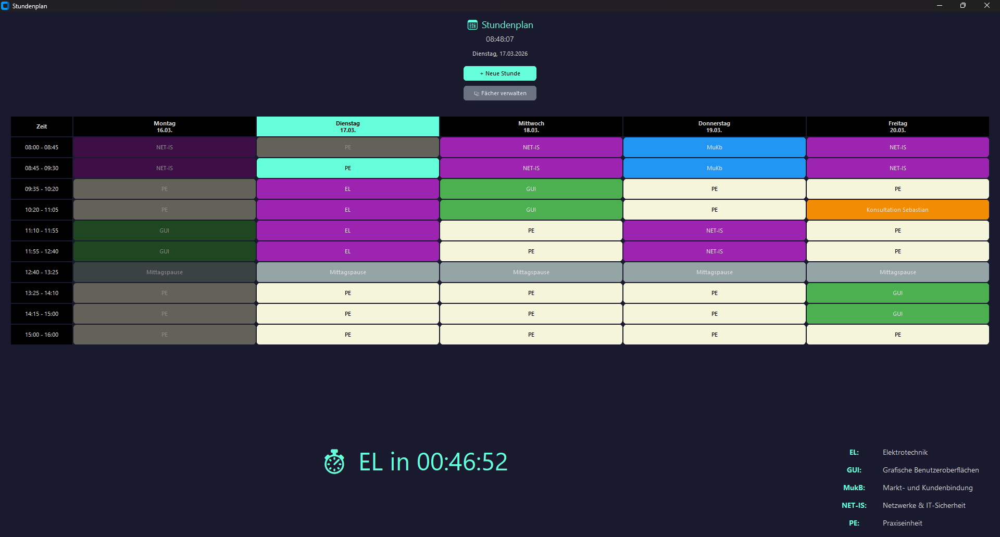
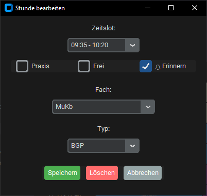

# 📅 Stundenplan

Ein intelligenter Wochenplaner für den Ausbildungs-Unterricht mit Live-Uhr, Farbcodierung und Smart-Benachrichtigungen.



## ✨ Features

- **Wochenansicht** - Übersichtliche Darstellung von Montag bis Freitag
- **Live-Uhr** - Aktuelle Uhrzeit und deutsches Datum
- **Heutiger Tag hervorgehoben** - Die aktuelle Tages-Spalte ist farblich markiert
- **Aktuelle Stunde markiert** - Die laufende Unterrichtsstunde hat einen Rahmen
- **Farbcodierung** - Verschiedene Farben für verschiedene Fachtypen
- **Smart-Benachrichtigungen** - Piepton 5 Minuten vor Unterrichtsbeginn (nur nach Mittagspause oder Praxiseinheit)
- **Feste Slots** - Mittagspause (12:40-13:25) und Praxis (15:00-16:00) automatisch eingetragen
- **Dark Mode** - Augenschonendes dunkles Design
- **Persistenz** - Stundenplan wird automatisch als JSON gespeichert

## 🖼️ Screenshots

### Hauptansicht


### Stunde bearbeiten


## 🚀 Installation

1. Repository klonen:
```bash
git clone https://github.com/DEIN-USERNAME/stundenplan.git
cd stundenplan
```

2. Programm starten:
```bash
python main.py
```

**Voraussetzungen:** Python 3.x mit Tkinter (standardmäßig enthalten)

## 📁 Projektstruktur

```
stundenplan/
│
├── main.py                    # Einstiegspunkt
│
├── config/                    # ⚙️ Konfiguration
│   ├── __init__.py
│   ├── constants.py           # Farben, Schriftgrößen, Fenster
│   └── time_config.py         # Zeitraster, Pausen, Wochentage
│
├── models/                    # 📦 Datenmodelle
│   ├── __init__.py
│   └── timetable.py           # Timetable-Klasse
│
├── services/                  # 🔧 Hintergrund-Dienste
│   ├── __init__.py
│   ├── storage.py             # JSON Save/Load
│   └── notification.py        # Benachrichtigungs-Logik
│
├── ui/                        # 🖼️ Benutzeroberfläche
│   ├── __init__.py
│   ├── main_window.py         # Hauptfenster
│   ├── timetable_view.py      # Tabellen-Anzeige
│   ├── edit_dialog.py         # Bearbeiten-Dialog
│   └── notification_popup.py  # Benachrichtigungs-Popup
│
├── screenshots/               # 📸 Screenshots für README
│
└── timetable.json             # 💾 Gespeicherter Stundenplan
```

## 🎨 Farbcodierung

| Typ | Farbe |
|-----|-------|
| AnwP (Python/SQL) | 🟢 Grün |
| BGP | 🔵 Blau |
| ITT | 🟣 Lila |
| Praxis | 🟫 Creme |
| Prüfung | 🔴 Rot |
| Mittagspause | ⚫ Grau |
| Frei | ⬛ Dunkelgrau |

## 🔔 Smart-Benachrichtigungen

Das Benachrichtigungs-System ist intelligent:
- Piepton ertönt **nur** wenn nach einer Mittagspause oder Praxiseinheit Unterricht beginnt
- Keine störenden Benachrichtigungen zwischen normalen Unterrichtsstunden
- 5 Minuten vor Beginn wird ein Popup mit Fachname und Uhrzeit angezeigt

## 🛠️ Bedienung

- **Neue Stunde hinzufügen:** Klick auf "+ Neue Stunde" Button ODER auf eine leere Zelle
- **Stunde bearbeiten:** Klick auf eine gefüllte Zelle
- **Stunde löschen:** Im Bearbeiten-Dialog auf "Löschen" klicken
- **Schnellauswahl:** Checkbox "Praxis" oder "Frei" für schnelles Eintragen

## 📝 Lizenz

Dieses Projekt wurde im Rahmen der Ausbildung zum Fachinformatiker für Anwendungsentwicklung erstellt.

---

*Entwickelt mit Python und Tkinter* 🐍
