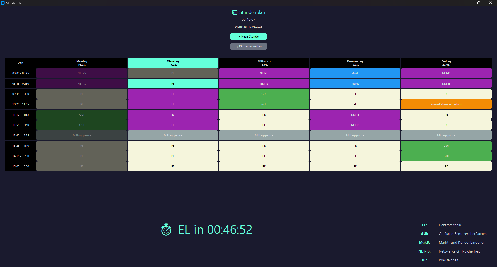
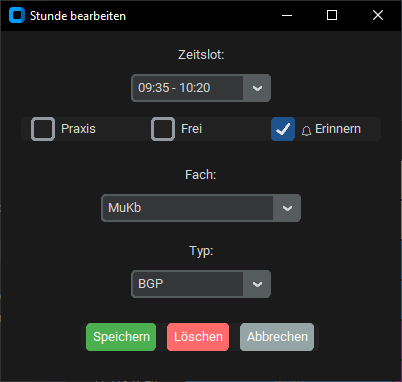
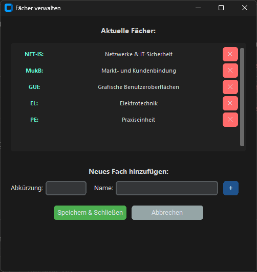

# 📅 Stundenplan

Ein intelligenter Wochenplaner für den Ausbildungs-Unterricht mit Live-Uhr, Countdown, Farbcodierung und individuellen Benachrichtigungen.



## ✨ Features

### 📊 Übersicht
- **Wochenansicht** - Übersichtliche Darstellung von Montag bis Freitag
- **Live-Uhr** - Aktuelle Uhrzeit und deutsches Datum
- **Heutiger Tag hervorgehoben** - Die aktuelle Tages-Spalte ist türkis markiert
- **Aktuelle Stunde markiert** - Die laufende Unterrichtsstunde hat einen schwarzen Rahmen
- **Vergangene Stunden abgedunkelt** - Bereits vergangene Stunden werden dunkler dargestellt
- **Farbcodierung** - Verschiedene Farben für verschiedene Fachtypen

### ⏱️ Countdown
- Großer Countdown bis zur nächsten **Unterrichtsstunde**
- Praxisstunden, Mittagspause und freie Stunden werden ignoriert
- Zeigt Fachname und verbleibende Zeit an

### 📚 Fächer-Verwaltung
- Fächer über Dialog hinzufügen und löschen
- Keine Code-Änderung nötig!
- Legende aktualisiert sich automatisch
- Fächer erscheinen als Vorschläge im Bearbeiten-Dialog

### 🔔 Benachrichtigungen
- Für jede Stunde kann die Checkbox **"🔔 Erinnern"** aktiviert werden
- 5 Minuten vor Beginn erscheint ein Popup mit Piepton
- Ideal für Stunden nach der Mittagspause oder nach Praxiseinheiten

### ⚡ Schnellauswahl
- Checkboxen für "Praxis" und "Frei" im Bearbeiten-Dialog
- Feste Slots: Mittagspause (12:40-13:25) automatisch eingetragen

### 💾 Persistenz
- Stundenplan wird automatisch als JSON gespeichert
- Fächer werden separat in `subjects.json` gespeichert
- Dark Mode mit CustomTkinter

## 🖼️ Screenshots

### Hauptansicht


### Stunde bearbeiten


### Fächer verwalten


## 🚀 Installation

1. Repository klonen:
```bash
git clone https://github.com/rwarny/stundenplan.git
cd stundenplan
```

2. CustomTkinter installieren:
```bash
pip install customtkinter
```

3. Programm starten:
```bash
python main.py
```

**Voraussetzungen:** Python 3.x, CustomTkinter

## 📁 Projektstruktur

```
stundenplan/
│
├── main.py                    # Einstiegspunkt
│
├── config/                    # ⚙️ Konfiguration
│   ├── __init__.py
│   ├── constants.py           # Farben, Schriftgrößen, Fenster
│   └── time_config.py         # Zeitraster, Pausen, Wochentage
│
├── models/                    # 📦 Datenmodelle
│   ├── __init__.py
│   └── timetable.py           # Timetable-Klasse
│
├── services/                  # 🔧 Hintergrund-Dienste
│   ├── __init__.py
│   ├── storage.py             # JSON Save/Load
│   └── notification.py        # Benachrichtigungs-Logik
│
├── ui/                        # 🖼️ Benutzeroberfläche
│   ├── __init__.py
│   ├── main_window.py         # Hauptfenster
│   ├── timetable_view.py      # Tabellen-Anzeige
│   ├── edit_dialog.py         # Bearbeiten-Dialog
│   ├── subjects_dialog.py     # Fächer-Verwaltung
│   └── notification_popup.py  # Benachrichtigungs-Popup
│
├── screenshots/               # 📸 Screenshots für README
│
├── timetable.json             # 💾 Gespeicherter Stundenplan
└── subjects.json              # 💾 Gespeicherte Fächer
```

## 🎨 Farbcodierung

| Typ | Farbe |
|-----|-------|
| AnwP (Python/SQL) | 🟢 Grün |
| BGP | 🔵 Blau |
| ITT | 🟣 Lila |
| Praxis | 🟫 Creme |
| Prüfung | 🔴 Rot |
| Mittagspause | ⚫ Grau |
| Frei | ⬛ Dunkelgrau |

## 🛠️ Bedienung

| Aktion | Beschreibung |
|--------|--------------|
| **Neue Stunde** | Klick auf "+ Neue Stunde" oder auf eine leere Zelle |
| **Stunde bearbeiten** | Klick auf eine gefüllte Zelle |
| **Stunde löschen** | Im Bearbeiten-Dialog auf "Löschen" klicken |
| **Praxis/Frei** | Checkbox im Bearbeiten-Dialog |
| **Benachrichtigung** | Checkbox "🔔 Erinnern" aktivieren |
| **Fächer verwalten** | Klick auf "📚 Fächer verwalten" |

## 📝 Lizenz

Dieses Projekt wurde im Rahmen der Umschulung zum Fachinformatiker für Anwendungsentwicklung erstellt.

---

*Entwickelt mit Python und CustomTkinter* 🐍
